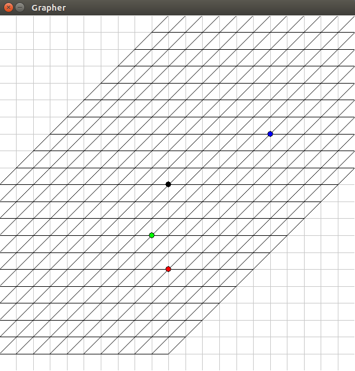

# linear-algebra-transform
simple visualisation of linear matrix transformations

## Code example
File: demo.py
```python
from Graph import *
from screen import *

BLACK, WHITE = (0,0,0),(255,255,255)
RED,GREEN,BLUE = (255,0,0),(0,255,0),(0,0,255)
SCREEN_WIDTH, SCREEN_HEIGHT = (600,600)
xAxis = np.linspace(-10,10,21)
yAxis = np.linspace(-10,10,21)

screen = Screen(SCREEN_WIDTH,SCREEN_HEIGHT,"Grapher")

#create 2d graph
surface = Graph2D(SCREEN_WIDTH,SCREEN_HEIGHT,xAxis,yAxis)
screen.addSurface(surface,0,0) #place graph

#plot black point of radius 5 in the origin (0,0)
surface.plot(0,0,BLACK,5)

#plot 3 random points
surface.plot(5,-5,RED,5)
surface.plot(2,-3,GREEN,5)
surface.plot(3,3,BLUE,5)

#transformation matrix
# [1 1]
# [0 1]
transform = np.array([[1,0],[1,1]]).T

#transform animation, 50 frames long
surface.transform(transform,50)
screen.setFPS(60)

screen.start()
```
## Screenshot


## Dependencies
- Pygame
- Numpy
- Python 3.3+
